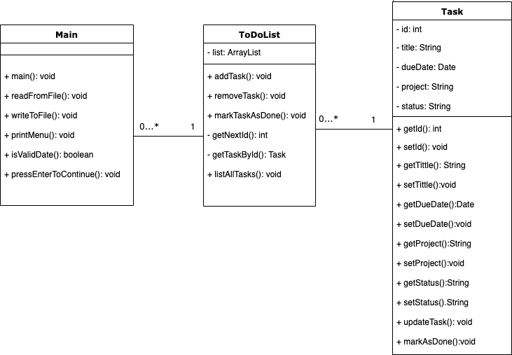

# To Do List

**A simple todo list application written in java. The todo list allows users to keep track of tasks at hand and classify them into projects where these tasks belong to. 
User can also quit and save the current task list to file, and then restart the application with the former state restored.
It is very simple to use, intuitive text based user interface that can be manipulated via the command line. 
The basic functionalities of the application are:**

* Display a collection of tasks that can be sorted both by date and project :point_left:
* Ability to manipulate with tasks: add, edit, mark as done and remove tasks :point_left:
* Load and save tasklist to file :point_left:

## Class Diagram

## User Manual     :computer:

### Summary:
1. Proview of the main menu
2. Proview of all the tasks that are already created 
3. Adding a new task
4. Editing a task
5. Saving a task

1. #### Proview of the main menu

When you start the application a main menu is shown as below: 

>>Pick an option:
>>* 1 - Show Task List (by Date or Project)
>>* 2 - Add New Tas
>>* 3 - Edit Task
>>* 4 - Mark Task as Done
>>* 5 - Remove Task from Task List
>>* 6 - Save and Exit the Program
>>* Your choice:

2. #### Proview of all the tasks that are already created 

By typing option No.1 choose how would you like to sort your tasks( by due date or by project)

3. #### Adding a new task

By typing option No.2 a new task can be created by entering:
* title (name of the task)
* date (the date must be entered in the correct format (YYYY-MM-DD)
* project(add a project name where the task belongs to) 

4. #### Editing a task

A task can be updated, mark as done or removed from the program by chosing the appropriate option from the main menu. 

5. #### Saving a task

By typing option No.4 the task can be saved with all the updates made and return to the main menu.

-**********-------------------
